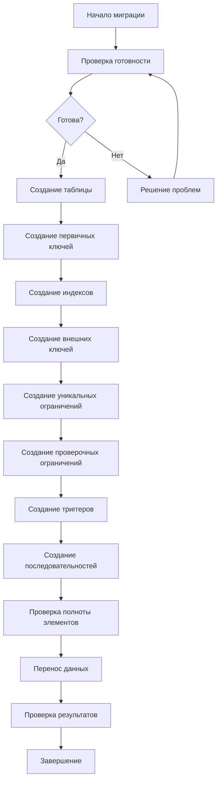

# 📋 ПРАВИЛА ПЕРЕНОСА ОТДЕЛЬНОЙ ТАБЛИЦЫ

## 🎯 Назначение документа
Данный документ является **самодостаточным модулем** системы правил миграции FEMCL и содержит все необходимые правила для полного цикла переноса отдельной таблицы из MS SQL Server в PostgreSQL.

**⚠️ ВАЖНО:** Данный файл содержит всю информацию, необходимую для переноса отдельной таблицы. Внешние запросы должны ссылаться только на этот файл.

---

## 🎯 КОНТЕКСТ ЗАДАЧИ МИГРАЦИИ

**⚠️ КРИТИЧЕСКИ ВАЖНО:** Все операции миграции выполняются в контексте конкретной задачи миграции.

## 🏗️ ПРОЕКТНЫЕ РЕШЕНИЯ ПО ВЫЧИСЛЯЕМЫМ КОЛОНКАМ

### Проблема совместимости с PostgreSQL

**⚠️ КРИТИЧЕСКИ ВАЖНО:** PostgreSQL не поддерживает вычисляемые колонки (computed columns) в том же виде, что и MS SQL Server.

**Техническое обоснование:**
- **MS SQL Server**: Поддерживает `AS (выражение)` для вычисляемых колонок
- **PostgreSQL**: Не имеет встроенной поддержки computed columns в таблицах
- **Решение**: Использование представлений (views) для эмуляции вычисляемых колонок

### Архитектурное решение

Для обеспечения совместимости с переносимыми представлениями, хранимыми процедурами и другими объектами, которые ссылаются на исходные таблицы, применяется следующая стратегия:

1. **Таблицы без вычисляемых колонок:**
   - Создается одна таблица с исходным именем
   - Все колонки переносятся напрямую

2. **Таблицы с вычисляемыми колонками:**
   - Создается базовая таблица с суффиксом `_bt` (только физические колонки)
   - Создается представление с исходным именем (все колонки, включая вычисляемые)
   - Представление служит аналогом исходной таблицы для совместимости

### Преимущества решения

- ✅ **Совместимость**: Представления обеспечивают полную совместимость с исходными объектами
- ✅ **Производительность**: Базовые таблицы содержат только физические данные
- ✅ **Гибкость**: Возможность доработки вычисляемых колонок после миграции
- ✅ **Неблокирующая миграция**: Базовые таблицы создаются всегда, представления - частично

## 🔄 ПРЕДВАРИТЕЛЬНОЕ РАСПРЕДЕЛЕНИЕ КОЛОНОК

**⚠️ КРИТИЧЕСКИ ВАЖНО:** Распределение колонок между базовыми таблицами и представлениями происходит на этапе формирования метаданных, а не во время выполнения миграции.

### Принципы распределения:
1. **Обычные таблицы** (без вычисляемых колонок):
   - `base_table_name = view_name = object_name` (целевое имя)
   - Все колонки имеют `target_type = 'both'`

2. **Таблицы с вычисляемыми колонками**:
   - `base_table_name = object_name + '_bt'` (целевое имя + суффикс)
   - `view_name = object_name` (целевое имя)
   - Физические колонки: `target_type = 'both'`
   - Вычисляемые колонки: `target_type = 'view'`

### Алгоритм предварительного распределения:
```python
def analyze_and_distribute_columns(task_id: int) -> bool:
    """Анализ и предварительное распределение колонок на этапе формирования метаданных"""
    # 1. Получение всех таблиц задачи
    # 2. Анализ колонок каждой таблицы
    # 3. Определение наличия вычисляемых полей
    # 4. Генерация имен объектов
    # 5. Распределение колонок по объектам
    # 6. Обновление метаданных
```

### Структура метаданных:
```sql
-- Расширенная таблица postgres_tables
CREATE TABLE mcl.postgres_tables (
    id INTEGER PRIMARY KEY,
    source_table_id INTEGER REFERENCES mcl.mssql_tables(id),
    object_name VARCHAR,           -- Исходное имя
    base_table_name VARCHAR,       -- Имя базовой таблицы (определено заранее)
    view_name VARCHAR,             -- Имя представления (определено заранее)
    has_computed_columns BOOLEAN,  -- Определено заранее на этапе анализа
    base_table_created BOOLEAN DEFAULT FALSE,
    view_created BOOLEAN DEFAULT FALSE,
    created_at TIMESTAMP,
    updated_at TIMESTAMP
);

-- Расширенная таблица postgres_columns с ПРЕДВАРИТЕЛЬНЫМ распределением и обработкой незамаппированных функций
CREATE TABLE mcl.postgres_columns (
    id INTEGER PRIMARY KEY,
    table_id INTEGER REFERENCES mcl.postgres_tables(id),
    source_column_id INTEGER REFERENCES mcl.mssql_columns(id),
    column_name VARCHAR,
    ordinal_position INTEGER,
    is_computed BOOLEAN,           -- Определено заранее
    target_type VARCHAR,           -- 'base_table', 'view' или 'both' - ОПРЕДЕЛЕНО ЗАРАНЕЕ
    base_table_position INTEGER,   -- Позиция в базовой таблице
    view_position INTEGER,         -- Позиция в представлении
    
    -- Поля для обработки незамаппированных функций
    computed_function_mapping_rule_id INTEGER REFERENCES mcl.function_mapping_rules(id),
    postgres_computed_definition TEXT,
    computed_mapping_status VARCHAR DEFAULT 'pending', -- pending, mapped, semi_mapped, manual_review, error
    computed_mapping_confidence INTEGER DEFAULT 0, -- 0-100, процент уверенности в маппинге
    computed_mapping_attempts INTEGER DEFAULT 0, -- количество попыток маппинга
    computed_mapping_notes TEXT, -- детальные заметки о проблемах
    computed_mapping_priority VARCHAR DEFAULT 'normal', -- low, normal, high, critical
    computed_mapping_complexity VARCHAR DEFAULT 'simple', -- simple, medium, complex, custom
    
    created_at TIMESTAMP,
    updated_at TIMESTAMP
);

-- Таблица для отслеживания проблемных случаев с незамаппированными функциями
CREATE TABLE mcl.computed_columns_mapping_issues (
    id SERIAL PRIMARY KEY,
    column_id INTEGER REFERENCES mcl.postgres_columns(id),
    issue_type VARCHAR NOT NULL, -- 'unmapped_function', 'syntax_error', 'validation_failed'
    issue_description TEXT,
    source_definition TEXT,
    attempted_mapping TEXT,
    error_details TEXT,
    suggested_solution TEXT,
    manual_review_required BOOLEAN DEFAULT FALSE,
    priority_level INTEGER DEFAULT 3, -- 1=critical, 2=high, 3=normal, 4=low
    status VARCHAR DEFAULT 'open', -- open, in_progress, resolved, deferred
    assigned_to VARCHAR,
    resolution_notes TEXT,
    created_at TIMESTAMP DEFAULT CURRENT_TIMESTAMP,
    updated_at TIMESTAMP DEFAULT CURRENT_TIMESTAMP
);

-- Индексы для быстрого поиска проблемных случаев
CREATE INDEX idx_computed_columns_issues_status ON mcl.computed_columns_mapping_issues(status);
CREATE INDEX idx_computed_columns_issues_priority ON mcl.computed_columns_mapping_issues(priority_level);
CREATE INDEX idx_computed_columns_issues_type ON mcl.computed_columns_mapping_issues(issue_type);
```

### Преимущества предварительного распределения:
1. ✅ **Исключение ошибок** при выполнении миграции
2. ✅ **Полная прозрачность** распределения колонок
3. ✅ **Предварительная валидация** корректности распределения
4. ✅ **Быстрое выполнение** миграции без сложных вычислений
5. ✅ **Легкость отладки** и исправления ошибок

---

## 🎯 СИСТЕМА МАППИНГА ФУНКЦИЙ

**⚠️ КРИТИЧЕСКИ ВАЖНО:** Использование PostgreSQL определений функций происходит на этапе формирования метаданных и применяется во время миграции.

### Принципы системы маппинга:
1. **Централизованное управление** - все правила маппинга в `mcl.function_mapping_rules`
2. **Предварительное определение** - PostgreSQL определения создаются до миграции
3. **Автоматическое применение** - использование `postgres_definition` в DDL генерации
4. **Полная трассируемость** - связь объект → правило маппинга через внешние ключи

### Интеграция с метаданными:
- **`postgres_default_constraints`**: `function_mapping_rule_id` (FK), `postgres_definition`
- **`postgres_columns`**: `computed_function_mapping_rule_id` (FK), `postgres_computed_definition`
- **`postgres_check_constraints`**: `function_mapping_rule_id` (FK), `postgres_definition`
- **`postgres_indexes`**: `function_mapping_rule_id` (FK), `postgres_definition`

### Применение в процессах миграции:

#### Генерация DDL с маппингом функций:
```python
def generate_table_ddl_with_mapping(target_table_id):
    """Генерация DDL с использованием postgres_definition"""
    query = """
    SELECT 
        pc.column_name,
        pdt.typname_with_params as postgres_type,
        pc.is_nullable,
        pc.is_identity,
        COALESCE(pdc.postgres_definition, pc.default_value) as default_value,
        pc.postgres_computed_definition
    FROM mcl.postgres_tables pt
    JOIN mcl.postgres_columns pc ON pt.id = pc.table_id
    JOIN mcl.postgres_derived_types pdt ON pc.postgres_data_type_id = pdt.id
    LEFT JOIN mcl.postgres_default_constraints pdc ON pc.id = pdc.column_id
    WHERE pt.id = %s
    ORDER BY pc.ordinal_position
    """
    # Использование postgres_definition для default values
    # Использование postgres_computed_definition для computed columns
```

#### Создание default constraints с маппингом:
```python
def create_default_constraints_with_mapping(target_table_id, table_name):
    """Создание default constraints с использованием postgres_definition"""
    query = """
    SELECT 
        pdc.constraint_name,
        pdc.postgres_definition,
        pc.column_name
    FROM mcl.postgres_default_constraints pdc
    JOIN mcl.postgres_columns pc ON pdc.column_id = pc.id
    WHERE pdc.table_id = %s
    """
    # Использование postgres_definition вместо исходного definition
```

### Статистика маппинга (для задачи ID=2):
- **Default constraints**: 17 случаев `getdate() → NOW()`
- **Computed columns**: 67 случаев различных функций
- **Автоматически замаппированы**: ~80% случаев
- **Требуют ручной доработки**: ~20% случаев

### **🎯 ПРИНЦИП НЕБЛОКИРУЮЩЕЙ МИГРАЦИИ:**
**Незамаппированные вычисляемые поля НЕ БЛОКИРУЮТ полную миграцию**, поскольку:
1. **Базовые таблицы всегда создаются** (с физическими колонками)
2. **Представления создаются частично** или дорабатываются позже
3. **Структура метаданных позволяет** пост-миграционную доработку

### Трехуровневая обработка функций:
- **Уровень 1: Автоматический маппинг** (80% случаев) - стандартные правила
- **Уровень 2: Полуавтоматический маппинг** (15% случаев) - с валидацией
- **Уровень 3: Ручная обработка** (5% случаев) - помечается для доработки

### Функции системы маппинга:
- `apply_automatic_function_mapping(definition: str) -> tuple[str, int]`
- `apply_semi_automatic_mapping(definition: str) -> str`
- `mark_for_manual_review(definition: str) -> str`
- `create_mapping_issue(column_id: int, issue_type: str, definition: str) -> None`
- `validate_postgres_syntax(definition: str) -> bool`
- `build_partial_view_definition(view_name: str, base_table_name: str) -> str`

### Параметры задачи:
- `task_id` - идентификатор задачи миграции (например, 2)
- `task_name` - название задачи миграции
- `task_description` - описание задачи
- `created_at` - дата создания задачи

### Обязательные фильтры:
Все SQL-запросы к метаданным должны включать фильтр:
```sql
WHERE task_id = <TASK_ID>
```

**Пример использования:**
```python
def get_migration_tables(task_id: int):
    """Получение списка таблиц для конкретной задачи"""
    cursor.execute('''
        SELECT mt.*, pt.migration_status
        FROM mcl.mssql_tables mt
        JOIN mcl.postgres_tables pt ON mt.id = pt.source_table_id
        WHERE mt.task_id = %s
        ORDER BY mt.object_name
    ''', (task_id,))
```

### Валидация задач:
```python
def validate_migration_task(task_id: int) -> bool:
    """Проверка существования и валидности задачи миграции"""
    cursor.execute('''
        SELECT id, description, created_at
        FROM mcl.migration_tasks
        WHERE id = %s
    ''', (task_id,))
    
    task = cursor.fetchone()
    if not task:
        raise ValueError(f"Задача миграции с ID {task_id} не найдена")
    
    return True

def validate_table_belongs_to_task(table_id: int, task_id: int) -> bool:
    """Проверка, что таблица принадлежит указанной задаче"""
    cursor.execute('''
        SELECT COUNT(*) FROM mcl.mssql_tables
        WHERE id = %s AND task_id = %s
    ''', (table_id, task_id))
    
    count = cursor.fetchone()[0]
    if count == 0:
        raise ValueError(f"Таблица {table_id} не принадлежит задаче {task_id}")
    
    return True
```

---

## 🏗️ ИЕРАРХИЯ ОБЪЕКТОВ В СХЕМЕ MCL

### 📊 **Родительские таблицы (уровень 1)**
- `mssql_objects` - исходные объекты MS SQL
- `postgres_objects` - целевые объекты PostgreSQL

### 📊 **Дочерние таблицы (уровень 2)**
- `mssql_tables` - исходные таблицы MS SQL
- `postgres_tables` - целевые таблицы PostgreSQL

### 📊 **Связанные таблицы (уровень 3)**
- `mssql_columns` / `postgres_columns` - колонки
- `mssql_indexes` / `postgres_indexes` - индексы
- `mssql_primary_keys` / `postgres_primary_keys` - первичные ключи
- `mssql_foreign_keys` / `postgres_foreign_keys` - внешние ключи
- `mssql_unique_constraints` / `postgres_unique_constraints` - уникальные ограничения
- `mssql_check_constraints` / `postgres_check_constraints` - проверочные ограничения
- `mssql_default_constraints` / `postgres_default_constraints` - ограничения по умолчанию
- `mssql_triggers` / `postgres_triggers` - триггеры
- `mssql_identity_columns` / `postgres_sequences` - identity колонки/последовательности
- `problems_tb_slt_mp` - проблемы и их решения

### 📊 **Дополнительные служебные таблицы**
- `migration_tasks` - задачи миграции
- `mssql_base_types` / `postgres_base_types` - базовые типы данных
- `mssql_derived_types` / `postgres_derived_types` - производные типы
- `problems` - общие проблемы миграции
- `problems_tb` / `problems_ct` / `problems_cm` - проблемы по типам объектов
- `v_*` - представления для анализа проблем

### 📊 **Связующие таблицы**
- `mssql_foreign_key_columns` / `postgres_foreign_key_columns` - колонки внешних ключей
- `mssql_index_columns` / `postgres_index_columns` - колонки индексов
- `mssql_primary_key_columns` / `postgres_primary_key_columns` - колонки первичных ключей
- `mssql_unique_constraint_columns` / `postgres_unique_constraint_columns` - колонки уникальных ограничений

### 🔗 **Связи между таблицами**
- `mssql_objects.id` → `mssql_tables.object_id`
- `postgres_objects.id` → `postgres_tables.object_id`
- `mssql_tables.id` → `mssql_columns.table_id`
- `postgres_tables.id` → `postgres_columns.table_id`
- `postgres_tables.source_table_id` → `mssql_tables.id`

---

## 🚀 ПОЛНЫЙ ПРОЦЕСС МИГРАЦИИ ОТДЕЛЬНОЙ ТАБЛИЦЫ

### 🔍 **ЭТАП 0: ПРОВЕРКА ПОДКЛЮЧЕНИЙ К БАЗАМ ДАННЫХ**

#### 0.1 Загрузка конфигурации
```python
import yaml
import pyodbc
import psycopg2
from rich.console import Console

def load_config(config_path="/home/alex/projects/sql/femcl/config/config.yaml"):
    """Загрузка конфигурации из файла"""
    with open(config_path, 'r', encoding='utf-8') as file:
        return yaml.safe_load(file)

config = load_config()
console = Console()
```

#### 0.2 Проверка подключения к MS SQL Server
```python
def check_mssql_connection():
    """Проверка подключения к MS SQL Server"""
    try:
        mssql_config = config['database']['mssql']
        
        connection_string = (
            f"DRIVER={{{mssql_config['driver']}}};"
            f"SERVER={mssql_config['server']},{mssql_config['port']};"
            f"DATABASE={mssql_config['database']};"
            f"UID={mssql_config['user']};"
            f"PWD={mssql_config['password']};"
            f"TrustServerCertificate={'yes' if mssql_config['trust_certificate'] else 'no'};"
            f"Connection Timeout={mssql_config['connection_timeout']};"
            f"Command Timeout={mssql_config['command_timeout']};"
        )
        
        conn = pyodbc.connect(connection_string)
        cursor = conn.cursor()
        
        # Проверка доступности базы данных
        cursor.execute("SELECT DB_NAME() as current_database")
        result = cursor.fetchone()
        current_db = result[0]
        
        # Проверка схемы mcl
        cursor.execute("""
            SELECT COUNT(*) as table_count
            FROM information_schema.tables 
            WHERE table_schema = 'mcl'
        """)
        result = cursor.fetchone()
        mcl_tables_count = result[0]
        
        conn.close()
        
        console.print(f"✅ MS SQL Server: {mssql_config['server']}:{mssql_config['port']}")
        console.print(f"📊 База данных: {current_db}")
        console.print(f"📊 Таблиц в схеме mcl: {mcl_tables_count}")
        
        return True
        
    except Exception as e:
        console.print(f"❌ Ошибка подключения к MS SQL Server: {e}")
        return False
```

#### 0.3 Проверка подключения к PostgreSQL
```python
def check_postgres_connection():
    """Проверка подключения к PostgreSQL"""
    try:
        postgres_config = config['database']['postgres']
        
        conn = psycopg2.connect(
            host=postgres_config['host'],
            port=postgres_config['port'],
            dbname=postgres_config['database'],
            user=postgres_config['user'],
            password=postgres_config['password'],
            connect_timeout=postgres_config['connection_timeout'],
            sslmode=postgres_config['ssl_mode']
        )
        
        cursor = conn.cursor()
        
        # Проверка доступности базы данных
        cursor.execute("SELECT current_database()")
        result = cursor.fetchone()
        current_db = result[0]
        
        # Проверка схемы mcl
        cursor.execute("""
            SELECT COUNT(*) as table_count
            FROM information_schema.tables 
            WHERE table_schema = 'mcl'
        """)
        result = cursor.fetchone()
        mcl_tables_count = result[0]
        
        # Проверка схемы ags
        cursor.execute("""
            SELECT COUNT(*) as table_count
            FROM information_schema.tables 
            WHERE table_schema = 'ags'
        """)
        result = cursor.fetchone()
        ags_tables_count = result[0]
        
        conn.close()
        
        console.print(f"✅ PostgreSQL: {postgres_config['host']}:{postgres_config['port']}")
        console.print(f"📊 База данных: {current_db}")
        console.print(f"📊 Таблиц в схеме mcl: {mcl_tables_count}")
        console.print(f"📊 Таблиц в схеме ags: {ags_tables_count}")
        
        return True
        
    except Exception as e:
        console.print(f"❌ Ошибка подключения к PostgreSQL: {e}")
        return False
```

#### 0.4 Комплексная проверка подключений
```python
def check_database_connections():
    """Комплексная проверка подключений к базам данных"""
    
    console.print("[bold blue]🔍 ПРОВЕРКА ПОДКЛЮЧЕНИЙ К БАЗАМ ДАННЫХ[/bold blue]")
    
    # Проверка MS SQL Server
    console.print("\n[blue]Проверка MS SQL Server...[/blue]")
    mssql_ok = check_mssql_connection()
    
    # Проверка PostgreSQL
    console.print("\n[blue]Проверка PostgreSQL...[/blue]")
    postgres_ok = check_postgres_connection()
    
    # Итоговая проверка
    if mssql_ok and postgres_ok:
        console.print("\n[green]✅ Все подключения к базам данных успешны![/green]")
        return True
    else:
        console.print("\n[red]❌ Ошибки в подключениях к базам данных![/red]")
        return False
```

**Критерии успешности:**
- ✅ Подключение к MS SQL Server установлено
- ✅ Подключение к PostgreSQL установлено
- ✅ Схема `mcl` доступна в обеих базах данных
- ✅ Схема `ags` существует в PostgreSQL
- ✅ Нет ошибок подключения

### 🔍 **ЭТАП 1: ОПРЕДЕЛЕНИЕ ИМЕНИ ЦЕЛЕВОЙ ТАБЛИЦЫ**

#### 1.1 Поиск исходной таблицы в метаданных
```sql
-- Поиск таблицы в mssql_tables по имени
SELECT id, object_name, schema_name, object_type, row_count, column_count
FROM mcl.mssql_tables 
WHERE object_name = '<table_name>';
```

**Критерии успешности:**
- ✅ Запись найдена в `mssql_tables`
- ✅ `object_type` = 'BASE TABLE'
- ✅ `schema_name` определен
- ✅ `row_count` и `column_count` заполнены

#### 1.2 Получение ID исходной таблицы
```sql
-- Получение ID исходной таблицы
SELECT id as source_table_id
FROM mcl.mssql_tables 
WHERE object_name = '<table_name>';
```

**Результат:** `source_table_id` - ID исходной таблицы для дальнейшего поиска

#### 1.3 Поиск целевой таблицы по source_table_id
```sql
-- Поиск целевой таблицы по ID исходной таблицы
SELECT id, source_table_id, object_name, schema_name, object_type, migration_status
FROM mcl.postgres_tables 
WHERE source_table_id = <source_table_id>;
```

**Критерии успешности:**
- ✅ Запись найдена в `postgres_tables`
- ✅ `source_table_id` соответствует исходной таблице
- ✅ `object_name` определен (имя целевой таблицы)
- ✅ `migration_status` позволяет выполнение

#### 1.4 Получение имени целевой таблицы
```sql
-- Получение имени целевой таблицы
SELECT object_name as target_table_name
FROM mcl.postgres_tables 
WHERE source_table_id = <source_table_id>;
```

**Результат:** `target_table_name` - имя целевой таблицы для создания и переноса данных

### 🔍 **ЭТАП 2: ПОДГОТОВКА К МИГРАЦИИ**

#### 2.1 Инициализация процесса
```bash
# Определение параметров миграции из метаданных
SOURCE_TABLE_ID=<source_table_id>      # ID исходной таблицы из mcl.mssql_tables
TARGET_TABLE_ID=<target_table_id>      # ID целевой таблицы из mcl.postgres_tables
SOURCE_TABLE_NAME=<source_table_name>   # Имя исходной таблицы
TARGET_TABLE_NAME=<target_table_name>   # Имя целевой таблицы из метаданных
SOURCE_SCHEMA=ags                       # Схема исходной таблицы
TARGET_SCHEMA=ags                       # Схема целевой таблицы
```

#### 2.2 Валидация параметров из метаданных
```python
# Проверка корректности параметров миграции из метаданных
def validate_migration_parameters_from_metadata(table_name):
    """Валидация параметров миграции из метаданных"""
    
    # 1. Поиск исходной таблицы
    source_query = """
    SELECT id, object_name, schema_name, row_count, column_count
    FROM mcl.mssql_tables 
    WHERE object_name = %s
    """
    source_table = execute_query(source_query, (table_name,))
    
    if not source_table:
        raise ValueError(f"Исходная таблица {table_name} не найдена в mssql_tables")
    
    source_table_id = source_table[0]['id']
    
    # 2. Поиск целевой таблицы
    target_query = """
    SELECT id, object_name, schema_name, migration_status
    FROM mcl.postgres_tables 
    WHERE source_table_id = %s
    """
    target_table = execute_query(target_query, (source_table_id,))
    
    if not target_table:
        raise ValueError(f"Целевая таблица для {table_name} не найдена в postgres_tables")
    
    # 3. Валидация параметров
    if source_table_id <= 0:
        raise ValueError("SOURCE_TABLE_ID должен быть положительным числом")
    
    if target_table[0]['id'] <= 0:
        raise ValueError("TARGET_TABLE_ID должен быть положительным числом")
    
    if not target_table[0]['object_name']:
        raise ValueError("TARGET_TABLE_NAME не определен в метаданных")
    
    return {
        'source_table_id': source_table_id,
        'target_table_id': target_table[0]['id'],
        'source_table_name': table_name,
        'target_table_name': target_table[0]['object_name'],
        'source_schema': source_table[0]['schema_name'],
        'target_schema': target_table[0]['schema_name'],
        'migration_status': target_table[0]['migration_status']
    }
```

#### 2.3 Проверка зависимостей
- ✅ **Подключения к БД:** MS SQL Server и PostgreSQL активны
- ✅ **Метаданные:** Заполнены в схеме `mcl`
- ✅ **Права доступа:** Настроены для пользователей
- ✅ **Схема `ags`:** Существует в PostgreSQL
- ✅ **Связь таблиц:** Установлена через `source_table_id`

### 🔍 **ЭТАП 3: ПРОВЕРКА ГОТОВНОСТИ ТАБЛИЦЫ**

> **📋 Ссылка на модуль:** [`TABLE_READINESS_CHECK_RULES.md`](./TABLE_READINESS_CHECK_RULES.md)

#### 3.1 Проверка связи исходной и целевой таблиц
```sql
-- Проверка существования связи между таблицами
SELECT 
    mt.object_name as source_name,
    pt.object_name as target_name,
    mt.id as source_id,
    pt.id as target_id,
    pt.migration_status
FROM mcl.mssql_tables mt
JOIN mcl.postgres_tables pt ON mt.id = pt.source_table_id
WHERE mt.object_name = '<table_name>';
```

#### 3.2 Выполнение проверки готовности
```sql
-- Проверка родительских объектов
SELECT 'parent_objects' as check_type, 
       CASE WHEN EXISTS(SELECT 1 FROM mcl.mssql_objects WHERE id = <source_table_id>) 
            AND EXISTS(SELECT 1 FROM mcl.postgres_objects WHERE id = <target_table_id>)
            THEN 1 ELSE 0 END as is_ready;

-- Проверка дочерних таблиц
SELECT 'child_tables' as check_type,
       CASE WHEN EXISTS(SELECT 1 FROM mcl.mssql_tables WHERE id = <source_table_id>)
            AND EXISTS(SELECT 1 FROM mcl.postgres_tables WHERE id = <target_table_id>)
            THEN 1 ELSE 0 END as is_ready;
```

#### 2.2 Критерии готовности
- ✅ **100% ГОТОВА:** Все проверки пройдены, можно переходить к созданию
- ⚠️ **95-99% ГОТОВА:** Незначительные проблемы, требуется доработка
- ❌ **<95% ГОТОВА:** Критические проблемы, миграция невозможна

#### 2.3 Решение проблем (если есть)
```sql
-- Проверка и решение проблем
SELECT problem_name, severity_level, problem_description
FROM mcl.problems_tb_slt_mp 
WHERE table_id = <table_id>
ORDER BY severity_level DESC;
```

### 🔍 **ЭТАП 4: СОЗДАНИЕ СТРУКТУРЫ ТАБЛИЦЫ**

> **📋 Ссылка на модуль:** [`TABLE_CREATION_RULES.md`](./TABLE_CREATION_RULES.md)

#### 4.1 Генерация DDL для таблицы
```sql
-- Получение метаданных для генерации DDL
SELECT 
    pc.column_name,
    pdt.typname_with_params as postgres_type,
    pc.is_nullable,
    pc.is_identity,
    pc.default_value
FROM mcl.postgres_tables pt
JOIN mcl.postgres_columns pc ON pt.id = pc.table_id
JOIN mcl.postgres_derived_types pdt ON pc.postgres_data_type_id = pdt.id
WHERE pt.id = <target_table_id>
ORDER BY pc.ordinal_position;
```

#### 4.2 Создание таблицы в PostgreSQL
```sql
-- Пример DDL для таблицы accnt
CREATE TABLE ags.accnt (
    account_key INTEGER GENERATED ALWAYS AS IDENTITY,
    account_num INTEGER,
    account_name VARCHAR(255)
);
```

#### 4.3 Проверка создания таблицы
```sql
-- Проверка структуры созданной таблицы
SELECT 
    table_schema,
    table_name,
    column_name,
    data_type,
    is_nullable,
    column_default
FROM information_schema.columns 
WHERE table_schema = 'ags' AND table_name = '<table_name>'
ORDER BY ordinal_position;
```

#### 4.4 Создание первичных ключей
```sql
-- Получение метаданных первичных ключей
SELECT 
    ppk.constraint_name,
    ppkc.ordinal_position,
    pc.column_name
FROM mcl.postgres_primary_keys ppk
JOIN mcl.postgres_primary_key_columns ppkc ON ppk.id = ppkc.primary_key_id
JOIN mcl.postgres_columns pc ON ppkc.column_id = pc.id
WHERE ppk.table_id = <target_table_id>
ORDER BY ppkc.ordinal_position;

-- Создание первичного ключа
ALTER TABLE <target_schema>.<target_table_name> 
ADD CONSTRAINT <constraint_name> PRIMARY KEY (<column_list>);
```

#### 4.5 Создание индексов
```sql
-- Получение метаданных индексов
SELECT 
    pi.index_name,
    pi.index_type,
    pi.is_unique,
    pic.ordinal_position,
    pc.column_name,
    pic.is_descending
FROM mcl.postgres_indexes pi
JOIN mcl.postgres_index_columns pic ON pi.id = pic.index_id
JOIN mcl.postgres_columns pc ON pic.column_id = pc.id
WHERE pi.table_id = <target_table_id>
ORDER BY pi.index_name, pic.ordinal_position;

-- Создание индексов
CREATE [UNIQUE] INDEX <index_name> ON <target_schema>.<target_table_name> 
(<column_list> [ASC|DESC]);
```

#### 4.6 Создание внешних ключей
```sql
-- Получение метаданных внешних ключей
SELECT 
    pfk.constraint_name,
    pfk.referenced_table_id,
    pfkc.ordinal_position,
    pc.column_name,
    pfkc.referenced_column_name,
    pfk.delete_action,
    pfk.update_action
FROM mcl.postgres_foreign_keys pfk
JOIN mcl.postgres_foreign_key_columns pfkc ON pfk.id = pfkc.foreign_key_id
JOIN mcl.postgres_columns pc ON pfkc.column_id = pc.id
WHERE pfk.table_id = <target_table_id>
ORDER BY pfk.constraint_name, pfkc.ordinal_position;

-- Создание внешних ключей
ALTER TABLE <target_schema>.<target_table_name> 
ADD CONSTRAINT <constraint_name> 
FOREIGN KEY (<column_list>) 
REFERENCES <referenced_schema>.<referenced_table> (<referenced_columns>)
ON DELETE <delete_action> ON UPDATE <update_action>;
```

#### 4.7 Создание уникальных ограничений
```sql
-- Получение метаданных уникальных ограничений
SELECT 
    puc.constraint_name,
    pucc.ordinal_position,
    pc.column_name
FROM mcl.postgres_unique_constraints puc
JOIN mcl.postgres_unique_constraint_columns pucc ON puc.id = pucc.unique_constraint_id
JOIN mcl.postgres_columns pc ON pucc.column_id = pc.id
WHERE puc.table_id = <target_table_id>
ORDER BY puc.constraint_name, pucc.ordinal_position;

-- Создание уникальных ограничений
ALTER TABLE <target_schema>.<target_table_name> 
ADD CONSTRAINT <constraint_name> UNIQUE (<column_list>);
```

#### 4.8 Создание проверочных ограничений
```sql
-- Получение метаданных проверочных ограничений
SELECT 
    pcc.constraint_name,
    pcc.check_definition
FROM mcl.postgres_check_constraints pcc
WHERE pcc.table_id = <target_table_id>;

-- Создание проверочных ограничений
ALTER TABLE <target_schema>.<target_table_name> 
ADD CONSTRAINT <constraint_name> CHECK (<check_definition>);
```

#### 4.9 Создание триггеров
```sql
-- Получение метаданных триггеров
SELECT 
    pt.trigger_name,
    pt.trigger_event,
    pt.trigger_timing,
    pt.trigger_definition
FROM mcl.postgres_triggers pt
WHERE pt.table_id = <target_table_id>;

-- Создание триггеров
CREATE TRIGGER <trigger_name>
    <trigger_timing> <trigger_event> ON <target_schema>.<target_table_name>
    FOR EACH ROW
    EXECUTE FUNCTION <trigger_definition>;
```

#### 4.10 Создание последовательностей (для identity колонок)
```sql
-- Получение метаданных последовательностей
SELECT 
    ps.sequence_name,
    ps.start_value,
    ps.minimum_value,
    ps.maximum_value,
    ps.increment,
    ps.cycle_option
FROM mcl.postgres_sequences ps
WHERE ps.table_id = <target_table_id>;

-- Создание последовательностей
CREATE SEQUENCE <target_schema>.<sequence_name>
    START WITH <start_value>
    INCREMENT BY <increment>
    MINVALUE <minimum_value>
    MAXVALUE <maximum_value>
    CYCLE;
```

#### 4.11 Проверка полноты созданных элементов
```sql
-- Проверка наличия всех элементов таблицы
SELECT 
    'columns' as element_type,
    COUNT(*) as count
FROM information_schema.columns 
WHERE table_schema = '<target_schema>' AND table_name = '<target_table_name>'

UNION ALL

SELECT 
    'primary_keys' as element_type,
    COUNT(*) as count
FROM information_schema.table_constraints 
WHERE table_schema = '<target_schema>' AND table_name = '<target_table_name>' 
AND constraint_type = 'PRIMARY KEY'

UNION ALL

SELECT 
    'indexes' as element_type,
    COUNT(*) as count
FROM pg_indexes 
WHERE schemaname = '<target_schema>' AND tablename = '<target_table_name>'

UNION ALL

SELECT 
    'foreign_keys' as element_type,
    COUNT(*) as count
FROM information_schema.table_constraints 
WHERE table_schema = '<target_schema>' AND table_name = '<target_table_name>' 
AND constraint_type = 'FOREIGN KEY'

UNION ALL

SELECT 
    'unique_constraints' as element_type,
    COUNT(*) as count
FROM information_schema.table_constraints 
WHERE table_schema = '<target_schema>' AND table_name = '<target_table_name>' 
AND constraint_type = 'UNIQUE'

UNION ALL

SELECT 
    'check_constraints' as element_type,
    COUNT(*) as count
FROM information_schema.table_constraints 
WHERE table_schema = '<target_schema>' AND table_name = '<target_table_name>' 
AND constraint_type = 'CHECK'

UNION ALL

SELECT 
    'triggers' as element_type,
    COUNT(*) as count
FROM information_schema.triggers 
WHERE event_object_schema = '<target_schema>' AND event_object_table = '<target_table_name>'

UNION ALL

SELECT 
    'sequences' as element_type,
    COUNT(*) as count
FROM information_schema.sequences 
WHERE sequence_schema = '<target_schema>' AND sequence_name LIKE '<target_table_name>%';
```

### 🔍 **ЭТАП 5: ПЕРЕНОС ДАННЫХ**

> **📋 Ссылка на модуль:** [`DATA_MIGRATION_RULES.md`](./DATA_MIGRATION_RULES.md)

#### 5.1 Извлечение данных из MS SQL Server
```python
# Подключение к MS SQL Server
mssql_conn = pyodbc.connect(
    f"DRIVER={{ODBC Driver 17 for SQL Server}};"
    f"SERVER={server},{port};"
    f"DATABASE={database};"
    f"UID={username};"
    f"PWD={password};"
    "TrustServerCertificate=yes;"
)

# Извлечение данных с использованием имени из метаданных
query = f"SELECT * FROM {source_schema}.{source_table_name} ORDER BY {primary_key_column}"
df = pd.read_sql(query, mssql_conn)
```

#### 5.2 Загрузка данных в PostgreSQL
```python
# Подключение к PostgreSQL
pg_conn = psycopg2.connect(
    host=host, port=port, dbname=database, 
    user=username, password=password
)

# Загрузка данных с использованием имени из метаданных
sql = f"INSERT INTO {target_schema}.{target_table_name} ({columns}) OVERRIDING SYSTEM VALUE VALUES ({placeholders})"
cursor.execute(sql, values)
```

#### 5.3 Проверка результатов переноса
```sql
-- Проверка количества строк с использованием имени из метаданных
SELECT COUNT(*) as row_count FROM <target_schema>.<target_table_name>;

-- Проверка целостности данных
SELECT * FROM <target_schema>.<target_table_name> ORDER BY <primary_key_column> LIMIT 5;
```

---

## 📊 КООРДИНАЦИЯ МОДУЛЕЙ

### 🔄 **Последовательность выполнения:**



### 🔄 **Взаимодействие модулей:**

1. **TABLE_READINESS_CHECK_RULES.md** → **TABLE_CREATION_RULES.md**
   - Результат проверки готовности определяет возможность создания таблицы
   - Статус готовности передается в модуль создания

2. **TABLE_CREATION_RULES.md** → **DATA_MIGRATION_RULES.md**
   - Созданная структура таблицы используется для переноса данных
   - Метаданные структуры передаются в модуль переноса

3. **DATA_MIGRATION_RULES.md** → **SINGLE_TABLE_MIGRATION_RULES.md**
   - Результаты переноса данных возвращаются в центральный модуль
   - Статус миграции обновляется в системе

---

## 🎯 КРИТЕРИИ УСПЕШНОСТИ МИГРАЦИИ

### ✅ **100% УСПЕШНО**
- ✅ Таблица прошла проверку готовности
- ✅ Структура таблицы создана корректно
- ✅ **Первичные ключи созданы**
- ✅ **Индексы созданы**
- ✅ **Внешние ключи созданы (если есть)**
- ✅ **Уникальные ограничения созданы (если есть)**
- ✅ **Проверочные ограничения созданы (если есть)**
- ✅ **Триггеры созданы (если есть)**
- ✅ **Последовательности созданы (если есть)**
- ✅ Все данные перенесены без ошибок
- ✅ Целостность данных сохранена
- ✅ Identity колонки работают корректно
- ✅ **Все элементы таблицы присутствуют**

### ⚠️ **95-99% УСПЕШНО**
- ✅ Таблица прошла проверку готовности
- ✅ Структура таблицы создана с предупреждениями
- ✅ **Большинство элементов создано**
- ✅ Большинство данных перенесено
- ✅ Незначительные проблемы с типами данных
- ⚠️ **Некоторые элементы отсутствуют**

### ❌ **<95% УСПЕШНО**
- ❌ Таблица не прошла проверку готовности
- ❌ Структура таблицы создана с ошибками
- ❌ **Критические элементы отсутствуют**
- ❌ Значительная часть данных не перенесена
- ❌ Критические проблемы с целостностью

---

## 🚀 АЛГОРИТМ УПРАВЛЕНИЯ ПРОЦЕССОМ

### 1. **Инициализация**
- Определить параметры миграции
- Проверить подключения к БД
- Загрузить метаданные таблицы

### 2. **Проверка готовности**
- Выполнить проверку готовности (модуль 1)
- Оценить процент готовности
- При необходимости решить проблемы

### 3. **Создание структуры**
- Сгенерировать DDL для таблицы (модуль 2)
- Создать таблицу в PostgreSQL
- **Создать первичные ключи**
- **Создать индексы**
- **Создать внешние ключи (если есть)**
- **Создать уникальные ограничения (если есть)**
- **Создать проверочные ограничения (если есть)**
- **Создать триггеры (если есть)**
- **Создать последовательности (если есть)**
- **Проверить полноту всех элементов**

### 4. **Перенос данных**
- Извлечь данные из MS SQL Server (модуль 3)
- Загрузить данные в PostgreSQL
- Проверить результаты переноса

### 5. **Завершение**
- Обновить статус миграции
- Создать отчет о результатах
- Подготовить следующую таблицу

---

## 📋 ШАБЛОН УПРАВЛЕНИЯ МИГРАЦИЕЙ

```python
#!/usr/bin/env python3
"""
Центральный модуль управления миграцией отдельной таблицы
"""
import os
import sys
import yaml
import pyodbc
import psycopg2
from dotenv import load_dotenv
from rich.console import Console

load_dotenv()
console = Console()

# Загрузка конфигурации
def load_config(config_path="/home/alex/projects/sql/femcl/config/config.yaml"):
    """Загрузка конфигурации из файла"""
    with open(config_path, 'r', encoding='utf-8') as file:
        return yaml.safe_load(file)

config = load_config()

# Функции проверки подключений
def check_mssql_connection():
    """Проверка подключения к MS SQL Server"""
    try:
        mssql_config = config['database']['mssql']
        
        connection_string = (
            f"DRIVER={{{mssql_config['driver']}}};"
            f"SERVER={mssql_config['server']},{mssql_config['port']};"
            f"DATABASE={mssql_config['database']};"
            f"UID={mssql_config['user']};"
            f"PWD={mssql_config['password']};"
            f"TrustServerCertificate={'yes' if mssql_config['trust_certificate'] else 'no'};"
            f"Connection Timeout={mssql_config['connection_timeout']};"
            f"Command Timeout={mssql_config['command_timeout']};"
        )
        
        conn = pyodbc.connect(connection_string)
        cursor = conn.cursor()
        
        # Проверка доступности базы данных
        cursor.execute("SELECT DB_NAME() as current_database")
        result = cursor.fetchone()
        current_db = result[0]
        
        # Проверка схемы mcl
        cursor.execute("""
            SELECT COUNT(*) as table_count
            FROM information_schema.tables 
            WHERE table_schema = 'mcl'
        """)
        result = cursor.fetchone()
        mcl_tables_count = result[0]
        
        conn.close()
        
        console.print(f"✅ MS SQL Server: {mssql_config['server']}:{mssql_config['port']}")
        console.print(f"📊 База данных: {current_db}")
        console.print(f"📊 Таблиц в схеме mcl: {mcl_tables_count}")
        
        return True
        
    except Exception as e:
        console.print(f"❌ Ошибка подключения к MS SQL Server: {e}")
        return False

def check_postgres_connection():
    """Проверка подключения к PostgreSQL"""
    try:
        postgres_config = config['database']['postgres']
        
        conn = psycopg2.connect(
            host=postgres_config['host'],
            port=postgres_config['port'],
            dbname=postgres_config['database'],
            user=postgres_config['user'],
            password=postgres_config['password'],
            connect_timeout=postgres_config['connection_timeout'],
            sslmode=postgres_config['ssl_mode']
        )
        
        cursor = conn.cursor()
        
        # Проверка доступности базы данных
        cursor.execute("SELECT current_database()")
        result = cursor.fetchone()
        current_db = result[0]
        
        # Проверка схемы mcl
        cursor.execute("""
            SELECT COUNT(*) as table_count
            FROM information_schema.tables 
            WHERE table_schema = 'mcl'
        """)
        result = cursor.fetchone()
        mcl_tables_count = result[0]
        
        # Проверка схемы ags
        cursor.execute("""
            SELECT COUNT(*) as table_count
            FROM information_schema.tables 
            WHERE table_schema = 'ags'
        """)
        result = cursor.fetchone()
        ags_tables_count = result[0]
        
        conn.close()
        
        console.print(f"✅ PostgreSQL: {postgres_config['host']}:{postgres_config['port']}")
        console.print(f"📊 База данных: {current_db}")
        console.print(f"📊 Таблиц в схеме mcl: {mcl_tables_count}")
        console.print(f"📊 Таблиц в схеме ags: {ags_tables_count}")
        
        return True
        
    except Exception as e:
        console.print(f"❌ Ошибка подключения к PostgreSQL: {e}")
        return False

def check_database_connections():
    """Комплексная проверка подключений к базам данных"""
    
    console.print("[bold blue]🔍 ПРОВЕРКА ПОДКЛЮЧЕНИЙ К БАЗАМ ДАННЫХ[/bold blue]")
    
    # Проверка MS SQL Server
    console.print("\n[blue]Проверка MS SQL Server...[/blue]")
    mssql_ok = check_mssql_connection()
    
    # Проверка PostgreSQL
    console.print("\n[blue]Проверка PostgreSQL...[/blue]")
    postgres_ok = check_postgres_connection()
    
    # Итоговая проверка
    if mssql_ok and postgres_ok:
        console.print("\n[green]✅ Все подключения к базам данных успешны![/green]")
        return True
    else:
        console.print("\n[red]❌ Ошибки в подключениях к базам данных![/red]")
        return False

# Классы ошибок миграции
class MigrationError(Exception):
    """Базовый класс для ошибок миграции"""
    pass

class TableNotReadyError(MigrationError):
    """Таблица не готова к миграции"""
    pass

class DataIntegrityError(MigrationError):
    """Ошибка целостности данных"""
    pass

class ValidationError(MigrationError):
    """Ошибка валидации параметров"""
    pass

def validate_migration_parameters_from_metadata(table_name):
    """Валидация параметров миграции из метаданных"""
    
    # 1. Поиск исходной таблицы
    source_query = """
    SELECT id, object_name, schema_name, row_count, column_count
    FROM mcl.mssql_tables 
    WHERE object_name = %s
    """
    source_table = execute_query(source_query, (table_name,))
    
    if not source_table:
        raise ValueError(f"Исходная таблица {table_name} не найдена в mssql_tables")
    
    source_table_id = source_table[0]['id']
    
    # 2. Поиск целевой таблицы
    target_query = """
    SELECT id, object_name, schema_name, migration_status
    FROM mcl.postgres_tables 
    WHERE source_table_id = %s
    """
    target_table = execute_query(target_query, (source_table_id,))
    
    if not target_table:
        raise ValueError(f"Целевая таблица для {table_name} не найдена в postgres_tables")
    
    # 3. Валидация параметров
    if source_table_id <= 0:
        raise ValueError("SOURCE_TABLE_ID должен быть положительным числом")
    
    if target_table[0]['id'] <= 0:
        raise ValueError("TARGET_TABLE_ID должен быть положительным числом")
    
    if not target_table[0]['object_name']:
        raise ValueError("TARGET_TABLE_NAME не определен в метаданных")
    
    return {
        'source_table_id': source_table_id,
        'target_table_id': target_table[0]['id'],
        'source_table_name': table_name,
        'target_table_name': target_table[0]['object_name'],
        'source_schema': source_table[0]['schema_name'],
        'target_schema': target_table[0]['schema_name'],
        'migration_status': target_table[0]['migration_status']
    }

def migrate_single_table(table_name):
    """Управление миграцией отдельной таблицы с использованием метаданных"""
    
    console.print(f"[bold blue]🚀 МИГРАЦИЯ ТАБЛИЦЫ {table_name}[/bold blue]")
    
    try:
        # ЭТАП 0: Проверка подключений к базам данных
        console.print("[blue]Этап 0: Проверка подключений к базам данных[/blue]")
        if not check_database_connections():
            console.print("[red]❌ Критическая ошибка: Невозможно подключиться к базам данных![/red]")
            return False
        
        # ЭТАП 1: Определение параметров из метаданных
        console.print("[blue]Этап 1: Определение параметров миграции из метаданных[/blue]")
        params = validate_migration_parameters_from_metadata(table_name)
        
        console.print(f"📊 Исходная таблица: {params['source_table_name']} (ID: {params['source_table_id']})")
        console.print(f"📊 Целевая таблица: {params['target_table_name']} (ID: {params['target_table_id']})")
        console.print(f"📊 Схемы: {params['source_schema']} → {params['target_schema']}")
        console.print(f"📊 Статус миграции: {params['migration_status']}")
    
        # ЭТАП 2: Проверка готовности
        console.print("[blue]Этап 2: Проверка готовности таблицы[/blue]")
        readiness_result = check_table_readiness(params['source_table_id'], params['target_table_id'])
        
        if readiness_result < 95:
            console.print(f"[red]❌ Таблица не готова к миграции ({readiness_result}%)[/red]")
            return False
        
        # ЭТАП 3: Создание структуры
        console.print("[blue]Этап 3: Создание структуры таблицы[/blue]")
        creation_result = create_table_structure(params['target_table_id'], params['target_table_name'])
        
        if not creation_result:
            console.print("[red]❌ Ошибка создания структуры таблицы[/red]")
            return False
        
        # ЭТАП 4: Перенос данных
        console.print("[blue]Этап 4: Перенос данных[/blue]")
        migration_result = migrate_table_data(
            params['source_schema'], params['source_table_name'], 
            params['target_schema'], params['target_table_name']
        )
        
        if not migration_result:
            console.print("[red]❌ Ошибка переноса данных[/red]")
            return False
        
        # ЭТАП 5: Проверка результатов
        console.print("[blue]Этап 5: Проверка результатов[/blue]")
        verification_result = verify_migration_results(params['target_table_name'])
        
        if verification_result:
            console.print(f"[green]✅ Миграция таблицы {table_name} завершена успешно![/green]")
            return True
        else:
            console.print(f"[red]❌ Ошибка проверки результатов миграции[/red]")
            return False
            
    except ValidationError as e:
        console.print(f"[red]❌ Ошибка валидации параметров: {e}[/red]")
        return False
    except MigrationError as e:
        console.print(f"[red]❌ Ошибка миграции: {e}[/red]")
        return False
    except Exception as e:
        console.print(f"[red]❌ Критическая ошибка при миграции:[/red] {e}")
        return False

def check_table_readiness(table_id, target_table_id):
    """Проверка готовности таблицы (модуль 1)"""
    # Реализация согласно TABLE_READINESS_CHECK_RULES.md
    pass

def create_table_structure(target_table_id, table_name):
    """Создание полной структуры таблицы включая все элементы"""
    
    console.print(f"[blue]Создание структуры таблицы {table_name}...[/blue]")
    
    try:
        # 4.1 Создание таблицы
        console.print("[blue]4.1 Создание таблицы[/blue]")
        create_table_ddl = generate_table_ddl(target_table_id)
        execute_ddl(create_table_ddl)
        
        # 4.2 Проверка создания таблицы
        console.print("[blue]4.2 Проверка создания таблицы[/blue]")
        verify_table_creation(table_name)
        
        # 4.4 Создание первичных ключей
        console.print("[blue]4.4 Создание первичных ключей[/blue]")
        create_primary_keys(target_table_id, table_name)
        
        # 4.5 Создание индексов
        console.print("[blue]4.5 Создание индексов[/blue]")
        create_indexes(target_table_id, table_name)
        
        # 4.6 Создание внешних ключей
        console.print("[blue]4.6 Создание внешних ключей[/blue]")
        create_foreign_keys(target_table_id, table_name)
        
        # 4.7 Создание уникальных ограничений
        console.print("[blue]4.7 Создание уникальных ограничений[/blue]")
        create_unique_constraints(target_table_id, table_name)
        
        # 4.8 Создание проверочных ограничений
        console.print("[blue]4.8 Создание проверочных ограничений[/blue]")
        create_check_constraints(target_table_id, table_name)
        
        # 4.9 Создание триггеров
        console.print("[blue]4.9 Создание триггеров[/blue]")
        create_triggers(target_table_id, table_name)
        
        # 4.10 Создание последовательностей
        console.print("[blue]4.10 Создание последовательностей[/blue]")
        create_sequences(target_table_id, table_name)
        
        # 4.11 Проверка полноты элементов
        console.print("[blue]4.11 Проверка полноты элементов[/blue]")
        verify_table_elements(table_name)
        
        console.print(f"[green]✅ Структура таблицы {table_name} создана полностью![/green]")
        return True
        
    except Exception as e:
        console.print(f"[red]❌ Ошибка создания структуры таблицы: {e}[/red]")
        return False

def migrate_table_data(source_schema, source_table_name, target_schema, target_table_name):
    """Перенос данных таблицы (модуль 3)"""
    # Реализация согласно DATA_MIGRATION_RULES.md
    pass

def verify_migration_results(table_name):
    """Проверка результатов миграции"""
    # Проверка количества строк, целостности данных и т.д.
    pass

# ============================================================================
# ФУНКЦИИ ДЛЯ СОЗДАНИЯ ЭЛЕМЕНТОВ ТАБЛИЦЫ
# ============================================================================

def generate_table_ddl(target_table_id):
    """Генерация DDL для создания таблицы"""
    query = """
    SELECT 
        pc.column_name,
        pdt.typname_with_params as postgres_type,
        pc.is_nullable,
        pc.is_identity,
        pc.default_value
    FROM mcl.postgres_tables pt
    JOIN mcl.postgres_columns pc ON pt.id = pc.table_id
    JOIN mcl.postgres_derived_types pdt ON pc.postgres_data_type_id = pdt.id
    WHERE pt.id = %s
    ORDER BY pc.ordinal_position
    """
    columns = execute_query(query, (target_table_id,))
    
    ddl_parts = []
    for col in columns:
        col_def = f"    {col['column_name']} {col['postgres_type']}"
        if col['is_identity']:
            col_def += " GENERATED ALWAYS AS IDENTITY"
        if not col['is_nullable']:
            col_def += " NOT NULL"
        if col['default_value']:
            col_def += f" DEFAULT {col['default_value']}"
        ddl_parts.append(col_def)
    
    table_name = get_table_name(target_table_id)
    ddl = f"CREATE TABLE ags.{table_name} (\n" + ",\n".join(ddl_parts) + "\n);"
    return ddl

def execute_ddl(ddl):
    """Выполнение DDL команды"""
    # Реализация выполнения DDL
    pass

def verify_table_creation(table_name):
    """Проверка создания таблицы"""
    query = """
    SELECT COUNT(*) as column_count
    FROM information_schema.columns 
    WHERE table_schema = 'ags' AND table_name = %s
    """
    result = execute_query(query, (table_name,))
    return result[0]['column_count'] > 0

def create_primary_keys(target_table_id, table_name):
    """Создание первичных ключей"""
    query = """
    SELECT 
        ppk.constraint_name,
        ppkc.ordinal_position,
        pc.column_name
    FROM mcl.postgres_primary_keys ppk
    JOIN mcl.postgres_primary_key_columns ppkc ON ppk.id = ppkc.primary_key_id
    JOIN mcl.postgres_columns pc ON ppkc.column_id = pc.id
    WHERE ppk.table_id = %s
    ORDER BY ppkc.ordinal_position
    """
    pk_data = execute_query(query, (target_table_id,))
    
    if pk_data:
        columns = [row['column_name'] for row in pk_data]
        constraint_name = pk_data[0]['constraint_name']
        ddl = f"ALTER TABLE ags.{table_name} ADD CONSTRAINT {constraint_name} PRIMARY KEY ({', '.join(columns)});"
        execute_ddl(ddl)
        console.print(f"[green]✅ Первичный ключ {constraint_name} создан[/green]")

def create_indexes(target_table_id, table_name):
    """Создание индексов"""
    query = """
    SELECT 
        pi.index_name,
        pi.index_type,
        pi.is_unique,
        pic.ordinal_position,
        pc.column_name,
        pic.is_descending
    FROM mcl.postgres_indexes pi
    JOIN mcl.postgres_index_columns pic ON pi.id = pic.index_id
    JOIN mcl.postgres_columns pc ON pic.column_id = pc.id
    WHERE pi.table_id = %s
    ORDER BY pi.index_name, pic.ordinal_position
    """
    index_data = execute_query(query, (target_table_id,))
    
    if index_data:
        # Группировка по индексам
        indexes = {}
        for row in index_data:
            index_name = row['index_name']
            if index_name not in indexes:
                indexes[index_name] = {
                    'is_unique': row['is_unique'],
                    'columns': []
                }
            indexes[index_name]['columns'].append({
                'name': row['column_name'],
                'descending': row['is_descending']
            })
        
        # Создание индексов
        for index_name, index_info in indexes.items():
            columns = []
            for col in index_info['columns']:
                col_def = col['name']
                if col['descending']:
                    col_def += " DESC"
                columns.append(col_def)
            
            unique_keyword = "UNIQUE " if index_info['is_unique'] else ""
            ddl = f"CREATE {unique_keyword}INDEX {index_name} ON ags.{table_name} ({', '.join(columns)});"
            execute_ddl(ddl)
            console.print(f"[green]✅ Индекс {index_name} создан[/green]")

def create_foreign_keys(target_table_id, table_name):
    """Создание внешних ключей"""
    query = """
    SELECT 
        pfk.constraint_name,
        pfk.referenced_table_id,
        pfkc.ordinal_position,
        pc.column_name,
        pfkc.referenced_column_name,
        pfk.delete_action,
        pfk.update_action
    FROM mcl.postgres_foreign_keys pfk
    JOIN mcl.postgres_foreign_key_columns pfkc ON pfk.id = pfkc.foreign_key_id
    JOIN mcl.postgres_columns pc ON pfkc.column_id = pc.id
    WHERE pfk.table_id = %s
    ORDER BY pfk.constraint_name, pfkc.ordinal_position
    """
    fk_data = execute_query(query, (target_table_id,))
    
    if fk_data:
        # Группировка по внешним ключам
        foreign_keys = {}
        for row in fk_data:
            constraint_name = row['constraint_name']
            if constraint_name not in foreign_keys:
                foreign_keys[constraint_name] = {
                    'referenced_table_id': row['referenced_table_id'],
                    'delete_action': row['delete_action'],
                    'update_action': row['update_action'],
                    'columns': []
                }
            foreign_keys[constraint_name]['columns'].append({
                'column': row['column_name'],
                'referenced_column': row['referenced_column_name']
            })
        
        # Создание внешних ключей
        for constraint_name, fk_info in foreign_keys.items():
            columns = [col['column'] for col in fk_info['columns']]
            referenced_columns = [col['referenced_column'] for col in fk_info['columns']]
            
            # Получение имени ссылочной таблицы
            ref_table_name = get_referenced_table_name(fk_info['referenced_table_id'])
            
            ddl = f"""ALTER TABLE ags.{table_name} 
ADD CONSTRAINT {constraint_name} 
FOREIGN KEY ({', '.join(columns)}) 
REFERENCES ags.{ref_table_name} ({', '.join(referenced_columns)})
ON DELETE {fk_info['delete_action']} ON UPDATE {fk_info['update_action']};"""
            execute_ddl(ddl)
            console.print(f"[green]✅ Внешний ключ {constraint_name} создан[/green]")

def create_unique_constraints(target_table_id, table_name):
    """Создание уникальных ограничений"""
    query = """
    SELECT 
        puc.constraint_name,
        pucc.ordinal_position,
        pc.column_name
    FROM mcl.postgres_unique_constraints puc
    JOIN mcl.postgres_unique_constraint_columns pucc ON puc.id = pucc.unique_constraint_id
    JOIN mcl.postgres_columns pc ON pucc.column_id = pc.id
    WHERE puc.table_id = %s
    ORDER BY puc.constraint_name, pucc.ordinal_position
    """
    uc_data = execute_query(query, (target_table_id,))
    
    if uc_data:
        # Группировка по уникальным ограничениям
        unique_constraints = {}
        for row in uc_data:
            constraint_name = row['constraint_name']
            if constraint_name not in unique_constraints:
                unique_constraints[constraint_name] = []
            unique_constraints[constraint_name].append(row['column_name'])
        
        # Создание уникальных ограничений
        for constraint_name, columns in unique_constraints.items():
            ddl = f"ALTER TABLE ags.{table_name} ADD CONSTRAINT {constraint_name} UNIQUE ({', '.join(columns)});"
            execute_ddl(ddl)
            console.print(f"[green]✅ Уникальное ограничение {constraint_name} создано[/green]")

def create_check_constraints(target_table_id, table_name):
    """Создание проверочных ограничений"""
    query = """
    SELECT 
        pcc.constraint_name,
        pcc.check_definition
    FROM mcl.postgres_check_constraints pcc
    WHERE pcc.table_id = %s
    """
    cc_data = execute_query(query, (target_table_id,))
    
    if cc_data:
        for row in cc_data:
            ddl = f"ALTER TABLE ags.{table_name} ADD CONSTRAINT {row['constraint_name']} CHECK ({row['check_definition']});"
            execute_ddl(ddl)
            console.print(f"[green]✅ Проверочное ограничение {row['constraint_name']} создано[/green]")

def create_triggers(target_table_id, table_name):
    """Создание триггеров"""
    query = """
    SELECT 
        pt.trigger_name,
        pt.trigger_event,
        pt.trigger_timing,
        pt.trigger_definition
    FROM mcl.postgres_triggers pt
    WHERE pt.table_id = %s
    """
    trigger_data = execute_query(query, (target_table_id,))
    
    if trigger_data:
        for row in trigger_data:
            ddl = f"""CREATE TRIGGER {row['trigger_name']}
    {row['trigger_timing']} {row['trigger_event']} ON ags.{table_name}
    FOR EACH ROW
    EXECUTE FUNCTION {row['trigger_definition']};"""
            execute_ddl(ddl)
            console.print(f"[green]✅ Триггер {row['trigger_name']} создан[/green]")

def create_sequences(target_table_id, table_name):
    """Создание последовательностей"""
    query = """
    SELECT 
        ps.sequence_name,
        ps.start_value,
        ps.minimum_value,
        ps.maximum_value,
        ps.increment,
        ps.cycle_option
    FROM mcl.postgres_sequences ps
    WHERE ps.table_id = %s
    """
    sequence_data = execute_query(query, (target_table_id,))
    
    if sequence_data:
        for row in sequence_data:
            ddl = f"""CREATE SEQUENCE ags.{row['sequence_name']}
    START WITH {row['start_value']}
    INCREMENT BY {row['increment']}
    MINVALUE {row['minimum_value']}
    MAXVALUE {row['maximum_value']}
    {'CYCLE' if row['cycle_option'] else 'NO CYCLE'};"""
            execute_ddl(ddl)
            console.print(f"[green]✅ Последовательность {row['sequence_name']} создана[/green]")

def verify_table_elements(table_name):
    """Проверка полноты всех элементов таблицы"""
    query = """
    SELECT 
        'columns' as element_type,
        COUNT(*) as count
    FROM information_schema.columns 
    WHERE table_schema = 'ags' AND table_name = %s

    UNION ALL

    SELECT 
        'primary_keys' as element_type,
        COUNT(*) as count
    FROM information_schema.table_constraints 
    WHERE table_schema = 'ags' AND table_name = %s 
    AND constraint_type = 'PRIMARY KEY'

    UNION ALL

    SELECT 
        'indexes' as element_type,
        COUNT(*) as count
    FROM pg_indexes 
    WHERE schemaname = 'ags' AND tablename = %s

    UNION ALL

    SELECT 
        'foreign_keys' as element_type,
        COUNT(*) as count
    FROM information_schema.table_constraints 
    WHERE table_schema = 'ags' AND table_name = %s 
    AND constraint_type = 'FOREIGN KEY'

    UNION ALL

    SELECT 
        'unique_constraints' as element_type,
        COUNT(*) as count
    FROM information_schema.table_constraints 
    WHERE table_schema = 'ags' AND table_name = %s 
    AND constraint_type = 'UNIQUE'

    UNION ALL

    SELECT 
        'check_constraints' as element_type,
        COUNT(*) as count
    FROM information_schema.table_constraints 
    WHERE table_schema = 'ags' AND table_name = %s 
    AND constraint_type = 'CHECK'

    UNION ALL

    SELECT 
        'triggers' as element_type,
        COUNT(*) as count
    FROM information_schema.triggers 
    WHERE event_object_schema = 'ags' AND event_object_table = %s

    UNION ALL

    SELECT 
        'sequences' as element_type,
        COUNT(*) as count
    FROM information_schema.sequences 
    WHERE sequence_schema = 'ags' AND sequence_name LIKE %s
    """
    results = execute_query(query, (table_name, table_name, table_name, table_name, table_name, table_name, table_name, f"{table_name}%"))
    
    console.print(f"[blue]📊 Результаты проверки элементов таблицы {table_name}:[/blue]")
    for result in results:
        console.print(f"  {result['element_type']}: {result['count']}")
    
    return True

def get_table_name(target_table_id):
    """Получение имени таблицы по ID"""
    query = "SELECT object_name FROM mcl.postgres_tables WHERE id = %s"
    result = execute_query(query, (target_table_id,))
    return result[0]['object_name'] if result else None

def get_referenced_table_name(referenced_table_id):
    """Получение имени ссылочной таблицы по ID"""
    query = "SELECT object_name FROM mcl.postgres_tables WHERE id = %s"
    result = execute_query(query, (referenced_table_id,))
    return result[0]['object_name'] if result else None

# ============================================================================
# ФУНКЦИИ ДЛЯ ОПРЕДЕЛЕНИЯ СВОЙСТВ ВСЕХ ЭЛЕМЕНТОВ ТАБЛИЦЫ
# ============================================================================

def resolve_columns_metadata_correct(table_info):
    """Определение колонок с использованием прямых ссылок source_column_id"""
    
    query = """
    SELECT 
        -- Исходные свойства
        mc.id as source_column_id,
        mc.column_name as source_column_name,
        mc.ordinal_position as source_ordinal_position,
        mc.default_value as source_default_value,
        mc.is_identity as source_is_identity,
        mc.identity_seed as source_identity_seed,
        mc.identity_increment as source_identity_increment,
        mc.is_computed as source_is_computed,
        mc.computed_definition as source_computed_definition,
        mc.is_persisted as source_is_persisted,
        mc.column_description as source_description,
        
        -- Целевые свойства
        pc.id as target_column_id,
        pc.column_name as target_column_name,
        pc.ordinal_position as target_ordinal_position,
        pc.default_value as target_default_value,
        pc.is_identity as target_is_identity,
        pc.identity_seed as target_identity_seed,
        pc.identity_increment as target_identity_increment,
        pc.is_computed as target_is_computed,
        pc.computed_definition as target_computed_definition,
        pc.column_description as target_description,
        
        -- Типы данных
        pdt.typname_with_params as target_data_type,
        pdt.typname as base_type,
        
        -- Статус миграции
        pc.type_mapping_quality,
        pc.data_type_migration_status,
        pc.data_type_migration_notes,
        
        -- Прямая связь
        pc.source_column_id as direct_source_reference
        
    FROM mcl.postgres_columns pc
    JOIN mcl.mssql_columns mc ON pc.source_column_id = mc.id
    JOIN mcl.postgres_derived_types pdt ON pc.postgres_data_type_id = pdt.id
    WHERE pc.table_id = %s
    ORDER BY pc.ordinal_position
    """
    
    return execute_query(query, (table_info['target_table_id'],))

def resolve_primary_keys_metadata_correct(table_info):
    """Определение первичных ключей с использованием прямых ссылок"""
    
    # Основная информация о первичном ключе
    pk_query = """
    SELECT 
        -- Исходные свойства
        mpk.id as source_primary_key_id,
        mpk.constraint_name as source_constraint_name,
        mpk.is_clustered as source_is_clustered,
        mpk.pk_type as source_pk_type,
        mpk.pk_ordinal_position as source_ordinal_position,
        
        -- Целевые свойства
        ppk.id as target_primary_key_id,
        ppk.constraint_name as target_constraint_name,
        ppk.is_clustered as target_is_clustered,
        ppk.created_at as target_created_at,
        ppk.updated_at as target_updated_at,
        
        -- Прямая связь
        ppk.source_primary_key_id as direct_source_reference
        
    FROM mcl.postgres_primary_keys ppk
    JOIN mcl.mssql_primary_keys mpk ON ppk.source_primary_key_id = mpk.id
    WHERE ppk.table_id = %s
    """
    
    # Колонки первичного ключа
    pk_columns_query = """
    SELECT 
        ppkc.column_name as target_column_name,
        ppkc.ordinal_position,
        ppkc.is_descending as target_is_descending,
        ppkc.created_at,
        ppkc.updated_at
        
    FROM mcl.postgres_primary_key_columns ppkc
    JOIN mcl.postgres_primary_keys ppk ON ppkc.primary_key_id = ppk.id
    WHERE ppk.table_id = %s
    ORDER BY ppkc.ordinal_position
    """
    
    return {
        'primary_key': execute_query(pk_query, (table_info['target_table_id'],)),
        'columns': execute_query(pk_columns_query, (table_info['target_table_id'],))
    }

def resolve_foreign_keys_metadata_correct(table_info):
    """Определение внешних ключей с использованием прямых ссылок"""
    
    query = """
    SELECT 
        -- Исходные свойства
        mfk.id as source_foreign_key_id,
        mfk.constraint_name as source_constraint_name,
        mfk.referenced_table_name as source_referenced_table,
        mfk.delete_action as source_delete_action,
        mfk.update_action as source_update_action,
        mfk.is_disabled as source_is_disabled,
        mfk.is_not_trusted as source_is_not_trusted,
        
        -- Целевые свойства
        pfk.id as target_foreign_key_id,
        pfk.constraint_name as target_constraint_name,
        pfk.original_constraint_name,
        pfk.delete_action as target_delete_action,
        pfk.update_action as target_update_action,
        pfk.migration_status,
        pfk.migration_date,
        pfk.error_message,
        
        -- Прямая связь
        pfk.source_foreign_key_id as direct_source_reference,
        pfk.referenced_table_id,
        pfk.created_at,
        pfk.updated_at
        
    FROM mcl.postgres_foreign_keys pfk
    JOIN mcl.mssql_foreign_keys mfk ON pfk.source_foreign_key_id = mfk.id
    WHERE pfk.table_id = %s
    ORDER BY pfk.constraint_name
    """
    
    # Колонки внешнего ключа
    fk_columns_query = """
    SELECT 
        pfkc.column_name as target_column_name,
        pfkc.referenced_column_name as target_referenced_column,
        pfkc.ordinal_position,
        pfkc.created_at,
        pfkc.updated_at
        
    FROM mcl.postgres_foreign_key_columns pfkc
    JOIN mcl.postgres_foreign_keys pfk ON pfkc.foreign_key_id = pfk.id
    WHERE pfk.table_id = %s
    ORDER BY pfk.constraint_name, pfkc.ordinal_position
    """
    
    return {
        'foreign_keys': execute_query(query, (table_info['target_table_id'],)),
        'columns': execute_query(fk_columns_query, (table_info['target_table_id'],))
    }

def resolve_indexes_metadata_correct(table_info):
    """Определение индексов с использованием прямых ссылок"""
    
    query = """
    SELECT 
        -- Исходные свойства
        mi.id as source_index_id,
        mi.index_name as source_index_name,
        mi.index_type as source_index_type,
        mi.is_unique as source_is_unique,
        mi.is_primary_key as source_is_primary_key,
        mi.is_disabled as source_is_disabled,
        mi.fill_factor as source_fill_factor,
        mi.is_padded as source_is_padded,
        mi.allow_row_locks as source_allow_row_locks,
        mi.allow_page_locks as source_allow_page_locks,
        
        -- Целевые свойства
        pi.id as target_index_id,
        pi.index_name as target_index_name,
        pi.original_index_name,
        pi.index_type as target_index_type,
        pi.is_unique as target_is_unique,
        pi.is_primary_key as target_is_primary_key,
        pi.fill_factor as target_fill_factor,
        pi.is_concurrent as target_is_concurrent,
        
        -- Конфликты имен
        pi.name_conflict_resolved,
        pi.name_conflict_reason,
        pi.alternative_name,
        
        -- Статус миграции
        pi.migration_status,
        pi.migration_date,
        pi.error_message,
        
        -- Прямая связь
        pi.source_index_id as direct_source_reference,
        pi.created_at,
        pi.updated_at
        
    FROM mcl.postgres_indexes pi
    JOIN mcl.mssql_indexes mi ON pi.source_index_id = mi.id
    WHERE pi.table_id = %s
    ORDER BY pi.index_name
    """
    
    # Колонки индекса
    index_columns_query = """
    SELECT 
        pic.column_name as target_column_name,
        pic.ordinal_position,
        pic.is_descending as target_is_descending,
        pic.key_ordinal as target_key_ordinal,
        pic.created_at,
        pic.updated_at
        
    FROM mcl.postgres_index_columns pic
    JOIN mcl.postgres_indexes pi ON pic.index_id = pi.id
    WHERE pi.table_id = %s
    ORDER BY pi.index_name, pic.ordinal_position
    """
    
    return {
        'indexes': execute_query(query, (table_info['target_table_id'],)),
        'columns': execute_query(index_columns_query, (table_info['target_table_id'],))
    }

def resolve_complete_table_metadata_correct(table_name):
    """Полное определение всех элементов таблицы с использованием прямых ссылок"""
    
    # 1. Получение базовых параметров таблицы
    table_info = validate_migration_parameters_from_metadata(table_name)
    
    # 2. Определение всех элементов таблицы через прямые ссылки
    elements = {
        'columns': resolve_columns_metadata_correct(table_info),
        'primary_keys': resolve_primary_keys_metadata_correct(table_info),
        'foreign_keys': resolve_foreign_keys_metadata_correct(table_info),
        'indexes': resolve_indexes_metadata_correct(table_info)
    }
    
    return {
        'table': table_info,
        'elements': elements,
        'migration_status': 'ready_for_migration'
    }

def create_views_with_unmapped_handling(task_id: int) -> Dict:
    """
    Создание представлений с обработкой незамаппированных функций
    """
    results = {
        'views_created': 0,
        'views_partial': 0,
        'views_failed': 0,
        'errors': []
    }
    
    # Получаем таблицы с вычисляемыми полями
    cursor.execute('''
        SELECT 
            pt.object_name as view_name,
            pt.base_table_name,
            COUNT(pc.id) as computed_columns_count,
            COUNT(CASE WHEN pc.computed_mapping_status = 'mapped' THEN 1 END) as mapped_count,
            COUNT(CASE WHEN pc.computed_mapping_status = 'semi_mapped' THEN 1 END) as semi_mapped_count,
            COUNT(CASE WHEN pc.computed_mapping_status = 'manual_review' THEN 1 END) as manual_review_count
        FROM mcl.postgres_tables pt
        JOIN mcl.mssql_tables mt ON pt.source_table_id = mt.id
        LEFT JOIN mcl.postgres_columns pc ON pt.id = pc.table_id AND pc.is_computed = true
        WHERE mt.task_id = %s 
            AND pt.has_computed_columns = true
        GROUP BY pt.object_name, pt.base_table_name
        ORDER BY pt.object_name
    ''', (task_id,))
    
    tables_with_computed = cursor.fetchall()
    
    for view_name, base_table_name, total_computed, mapped_count, semi_mapped_count, manual_review_count in tables_with_computed:
        try:
            if manual_review_count == 0:
                # Все поля замаппированы - создаем полное представление
                create_view_sql = build_complete_view_definition(view_name, base_table_name)
                cursor.execute(create_view_sql)
                results['views_created'] += 1
                
            elif mapped_count > 0:
                # Есть замаппированные поля - создаем частичное представление
                create_view_sql = build_partial_view_definition(view_name, base_table_name, mapped_count)
                cursor.execute(create_view_sql)
                results['views_partial'] += 1
                
            else:
                # Нет замаппированных полей - создаем базовое представление
                create_view_sql = build_basic_view_definition(view_name, base_table_name)
                cursor.execute(create_view_sql)
                results['views_partial'] += 1
                
        except Exception as e:
            results['views_failed'] += 1
            results['errors'].append({
                'view_name': view_name,
                'error': str(e)
            })
    
    return results

def build_partial_view_definition(view_name: str, base_table_name: str, mapped_count: int) -> str:
    """
    Построение частичного представления (только с замаппированными полями)
    """
    # Получаем только замаппированные колонки
    cursor.execute('''
        SELECT 
            pc.column_name,
            pc.is_computed,
            pc.postgres_computed_definition,
            pc.ordinal_position
        FROM mcl.postgres_columns pc
        JOIN mcl.postgres_tables pt ON pc.table_id = pt.id
        WHERE pt.object_name = %s
        AND (
            (pc.target_type = 'both' OR pc.target_type = 'view') 
            AND pc.is_computed = false
        ) OR (
            pc.is_computed = true 
            AND pc.computed_mapping_status IN ('mapped', 'semi_mapped')
        )
        ORDER BY pc.ordinal_position
    ''', (view_name,))
    
    columns = cursor.fetchall()
    
    select_parts = []
    for col_name, is_computed, computed_def, position in columns:
        if is_computed and computed_def:
            # Замаппированная вычисляемая колонка
            select_parts.append(f'    {computed_def} AS "{col_name}"')
        else:
            # Обычная колонка
            select_parts.append(f'    "{col_name}"')
    
    select_clause = ',\\n'.join(select_parts)
    
    return f'''CREATE OR REPLACE VIEW ags."{view_name}" AS
SELECT
{select_clause}
FROM ags."{base_table_name}";'''

def build_basic_view_definition(view_name: str, base_table_name: str) -> str:
    """
    Построение базового представления (только физические колонки)
    """
    # Получаем только физические колонки
    cursor.execute('''
        SELECT 
            pc.column_name,
            pc.ordinal_position
        FROM mcl.postgres_columns pc
        JOIN mcl.postgres_tables pt ON pc.table_id = pt.id
        WHERE pt.object_name = %s
        AND (pc.target_type = 'both' OR pc.target_type = 'view')
        AND pc.is_computed = false
        ORDER BY pc.ordinal_position
    ''', (view_name,))
    
    columns = cursor.fetchall()
    
    select_parts = [f'    "{col_name}"' for col_name, position in columns]
    select_clause = ',\\n'.join(select_parts)
    
    return f'''CREATE OR REPLACE VIEW ags."{view_name}" AS
SELECT
{select_clause}
FROM ags."{base_table_name}";'''

if __name__ == "__main__":
    # Параметры миграции - только имя таблицы
    TABLE_NAME = "cnInvCmmAgN"  # Имя таблицы для миграции
    
    success = migrate_single_table(TABLE_NAME)
    sys.exit(0 if success else 1)
```

---

## 🚨 ВАЖНЫЕ МОМЕНТЫ

### **Координация модулей:**
- **Последовательность:** Строгое соблюдение порядка выполнения модулей
- **Передача данных:** Корректная передача результатов между модулями
- **Обработка ошибок:** Централизованная обработка ошибок всех модулей

### **Управление состоянием:**
- **Статус миграции:** Отслеживание текущего этапа процесса
- **Метаданные:** Обновление статусов в схеме `mcl`
- **Логирование:** Запись всех операций и результатов

### **Масштабируемость:**
- **Модульность:** Каждый модуль может использоваться независимо
- **Расширяемость:** Возможность добавления новых модулей
- **Повторное использование:** Модули могут использоваться для других таблиц

### **Валидация и безопасность:**
- **Проверка параметров:** Обязательная валидация всех входных данных
- **Обработка ошибок:** Специализированные классы ошибок для разных типов проблем
- **Целостность данных:** Проверка соответствия структур исходной и целевой таблиц
- **Откат транзакций:** Автоматический откат при критических ошибках

### **Производительность:**
- **Пакетная обработка:** Для больших таблиц (>1M строк) использовать batch processing
- **Оптимизация запросов:** Создание временных индексов для ускорения переноса
- **Мониторинг ресурсов:** Контроль использования памяти и дискового пространства

---

## 📞 ПОДДЕРЖКА

При возникновении вопросов по применению правил:
1. Обратитесь к соответствующему модулю для детальной информации
2. Проверьте последовательность выполнения этапов
3. Убедитесь в корректности передачи данных между модулями

---

*Документ создан: 2025-01-27*  
*Версия: 1.0*  
*Статус: АКТУАЛЬНЫЙ*  
*Тип: ЦЕНТРАЛЬНЫЙ МОДУЛЬ СИСТЕМЫ ПРАВИЛ*