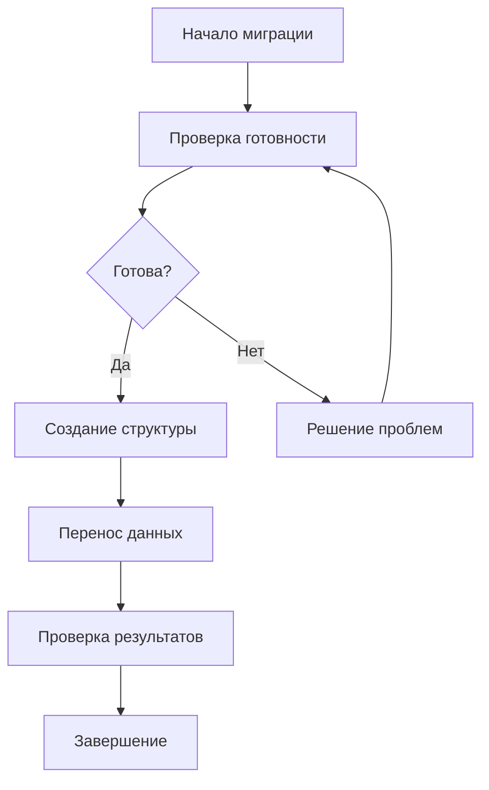

# 📋 ПРАВИЛА ПЕРЕНОСА ОТДЕЛЬНОЙ ТАБЛИЦЫ

## 🎯 Назначение документа
Данный документ является **самодостаточным модулем** системы правил миграции FEMCL и содержит все необходимые правила для полного цикла переноса отдельной таблицы из MS SQL Server в PostgreSQL.

**⚠️ ВАЖНО:** Данный файл содержит всю информацию, необходимую для переноса отдельной таблицы. Внешние запросы должны ссылаться только на этот файл.

---

## 🏗️ ИЕРАРХИЯ ОБЪЕКТОВ В СХЕМЕ MCL

### 📊 **Родительские таблицы (уровень 1)**
- `mssql_objects` - исходные объекты MS SQL
- `postgres_objects` - целевые объекты PostgreSQL

### 📊 **Дочерние таблицы (уровень 2)**
- `mssql_tables` - исходные таблицы MS SQL
- `postgres_tables` - целевые таблицы PostgreSQL

### 📊 **Связанные таблицы (уровень 3)**
- `mssql_columns` / `postgres_columns` - колонки
- `mssql_indexes` / `postgres_indexes` - индексы
- `mssql_primary_keys` / `postgres_primary_keys` - первичные ключи
- `mssql_foreign_keys` / `postgres_foreign_keys` - внешние ключи
- `mssql_unique_constraints` / `postgres_unique_constraints` - уникальные ограничения
- `mssql_check_constraints` / `postgres_check_constraints` - проверочные ограничения
- `mssql_default_constraints` / `postgres_default_constraints` - ограничения по умолчанию
- `mssql_triggers` / `postgres_triggers` - триггеры
- `mssql_identity_columns` / `postgres_sequences` - identity колонки/последовательности
- `problems_tb_slt_mp` - проблемы и их решения

### 📊 **Дополнительные служебные таблицы**
- `migration_tasks` - задачи миграции
- `mssql_base_types` / `postgres_base_types` - базовые типы данных
- `mssql_derived_types` / `postgres_derived_types` - производные типы
- `problems` - общие проблемы миграции
- `problems_tb` / `problems_ct` / `problems_cm` - проблемы по типам объектов
- `v_*` - представления для анализа проблем

### 📊 **Связующие таблицы**
- `mssql_foreign_key_columns` / `postgres_foreign_key_columns` - колонки внешних ключей
- `mssql_index_columns` / `postgres_index_columns` - колонки индексов
- `mssql_primary_key_columns` / `postgres_primary_key_columns` - колонки первичных ключей
- `mssql_unique_constraint_columns` / `postgres_unique_constraint_columns` - колонки уникальных ограничений

### 🔗 **Связи между таблицами**
- `mssql_objects.id` → `mssql_tables.object_id`
- `postgres_objects.id` → `postgres_tables.object_id`
- `mssql_tables.id` → `mssql_columns.table_id`
- `postgres_tables.id` → `postgres_columns.table_id`
- `postgres_tables.source_table_id` → `mssql_tables.id`

---

## 🚀 ПОЛНЫЙ ПРОЦЕСС МИГРАЦИИ ОТДЕЛЬНОЙ ТАБЛИЦЫ

### 🔍 **ЭТАП 1: ПОДГОТОВКА К МИГРАЦИИ**

#### 1.1 Инициализация процесса
```bash
# Определение параметров миграции
TABLE_ID=<table_id>                    # ID исходной таблицы в mcl.mssql_tables
TARGET_TABLE_ID=<target_table_id>      # ID целевой таблицы в mcl.postgres_tables
TABLE_NAME=<table_name>                 # Имя таблицы для миграции
SCHEMA_NAME=ags                         # Целевая схема PostgreSQL
```

#### 1.2 Валидация входных параметров
```python
# Проверка корректности входных параметров
def validate_migration_parameters(table_id, target_table_id, table_name):
    """Валидация параметров миграции"""
    if not table_id or table_id <= 0:
        raise ValueError("TABLE_ID должен быть положительным числом")
    
    if not target_table_id or target_table_id <= 0:
        raise ValueError("TARGET_TABLE_ID должен быть положительным числом")
    
    if not table_name or not isinstance(table_name, str):
        raise ValueError("TABLE_NAME должен быть непустой строкой")
    
    if not table_name.isalnum() and '_' not in table_name:
        raise ValueError("TABLE_NAME должен содержать только буквы, цифры и подчеркивания")
    
    return True
```

#### 1.3 Проверка зависимостей
- ✅ **Подключения к БД:** MS SQL Server и PostgreSQL активны
- ✅ **Метаданные:** Заполнены в схеме `mcl`
- ✅ **Права доступа:** Настроены для пользователей
- ✅ **Схема `ags`:** Существует в PostgreSQL

### 🔍 **ЭТАП 2: ПРОВЕРКА ГОТОВНОСТИ ТАБЛИЦЫ**

> **📋 Ссылка на модуль:** [`TABLE_READINESS_CHECK_RULES.md`](./TABLE_READINESS_CHECK_RULES.md)

#### 2.1 Выполнение проверки готовности
```sql
-- Проверка родительских объектов
SELECT 'parent_objects' as check_type, 
       CASE WHEN EXISTS(SELECT 1 FROM mcl.mssql_objects WHERE id = <table_id>) 
            AND EXISTS(SELECT 1 FROM mcl.postgres_objects WHERE id = <target_table_id>)
            THEN 1 ELSE 0 END as is_ready;

-- Проверка дочерних таблиц
SELECT 'child_tables' as check_type,
       CASE WHEN EXISTS(SELECT 1 FROM mcl.mssql_tables WHERE id = <table_id>)
            AND EXISTS(SELECT 1 FROM mcl.postgres_tables WHERE id = <target_table_id>)
            THEN 1 ELSE 0 END as is_ready;
```

#### 2.2 Критерии готовности
- ✅ **100% ГОТОВА:** Все проверки пройдены, можно переходить к созданию
- ⚠️ **95-99% ГОТОВА:** Незначительные проблемы, требуется доработка
- ❌ **<95% ГОТОВА:** Критические проблемы, миграция невозможна

#### 2.3 Решение проблем (если есть)
```sql
-- Проверка и решение проблем
SELECT problem_name, severity_level, problem_description
FROM mcl.problems_tb_slt_mp 
WHERE table_id = <table_id>
ORDER BY severity_level DESC;
```

### 🔍 **ЭТАП 3: СОЗДАНИЕ СТРУКТУРЫ ТАБЛИЦЫ**

> **📋 Ссылка на модуль:** [`TABLE_CREATION_RULES.md`](./TABLE_CREATION_RULES.md)

#### 3.1 Генерация DDL для таблицы
```sql
-- Получение метаданных для генерации DDL
SELECT 
    pc.column_name,
    pdt.typname_with_params as postgres_type,
    pc.is_nullable,
    pc.is_identity,
    pc.default_value
FROM mcl.postgres_tables pt
JOIN mcl.postgres_columns pc ON pt.id = pc.table_id
JOIN mcl.postgres_derived_types pdt ON pc.postgres_data_type_id = pdt.id
WHERE pt.id = <target_table_id>
ORDER BY pc.ordinal_position;
```

#### 3.2 Создание таблицы в PostgreSQL
```sql
-- Пример DDL для таблицы accnt
CREATE TABLE ags.accnt (
    account_key INTEGER GENERATED ALWAYS AS IDENTITY PRIMARY KEY,
    account_num INTEGER NOT NULL,
    account_name VARCHAR(255) NOT NULL
);
```

#### 3.3 Проверка создания таблицы
```sql
-- Проверка структуры созданной таблицы
SELECT 
    table_schema,
    table_name,
    column_name,
    data_type,
    is_nullable,
    column_default
FROM information_schema.columns 
WHERE table_schema = 'ags' AND table_name = '<table_name>'
ORDER BY ordinal_position;
```

### 🔍 **ЭТАП 4: ПЕРЕНОС ДАННЫХ**

> **📋 Ссылка на модуль:** [`DATA_MIGRATION_RULES.md`](./DATA_MIGRATION_RULES.md)

#### 4.1 Извлечение данных из MS SQL Server
```python
# Подключение к MS SQL Server
mssql_conn = pyodbc.connect(
    f"DRIVER={{ODBC Driver 17 for SQL Server}};"
    f"SERVER={server},{port};"
    f"DATABASE={database};"
    f"UID={username};"
    f"PWD={password};"
    "TrustServerCertificate=yes;"
)

# Извлечение данных
query = f"SELECT * FROM ags.{table_name} ORDER BY {primary_key_column}"
df = pd.read_sql(query, mssql_conn)
```

#### 4.2 Загрузка данных в PostgreSQL
```python
# Подключение к PostgreSQL
pg_conn = psycopg2.connect(
    host=host, port=port, dbname=database, 
    user=username, password=password
)

# Загрузка данных с обработкой identity колонок
sql = f"INSERT INTO ags.{table_name} ({columns}) OVERRIDING SYSTEM VALUE VALUES ({placeholders})"
cursor.execute(sql, values)
```

#### 4.3 Проверка результатов переноса
```sql
-- Проверка количества строк
SELECT COUNT(*) as row_count FROM ags.<table_name>;

-- Проверка целостности данных
SELECT * FROM ags.<table_name> ORDER BY <primary_key_column> LIMIT 5;
```

---

## 📊 КООРДИНАЦИЯ МОДУЛЕЙ

### 🔄 **Последовательность выполнения:**



### 🔄 **Взаимодействие модулей:**

1. **TABLE_READINESS_CHECK_RULES.md** → **TABLE_CREATION_RULES.md**
   - Результат проверки готовности определяет возможность создания таблицы
   - Статус готовности передается в модуль создания

2. **TABLE_CREATION_RULES.md** → **DATA_MIGRATION_RULES.md**
   - Созданная структура таблицы используется для переноса данных
   - Метаданные структуры передаются в модуль переноса

3. **DATA_MIGRATION_RULES.md** → **SINGLE_TABLE_MIGRATION_RULES.md**
   - Результаты переноса данных возвращаются в центральный модуль
   - Статус миграции обновляется в системе

---

## 🎯 КРИТЕРИИ УСПЕШНОСТИ МИГРАЦИИ

### ✅ **100% УСПЕШНО**
- ✅ Таблица прошла проверку готовности
- ✅ Структура таблицы создана корректно
- ✅ Все данные перенесены без ошибок
- ✅ Целостность данных сохранена
- ✅ Identity колонки работают корректно

### ⚠️ **95-99% УСПЕШНО**
- ✅ Таблица прошла проверку готовности
- ✅ Структура таблицы создана с предупреждениями
- ✅ Большинство данных перенесено
- ✅ Незначительные проблемы с типами данных

### ❌ **<95% УСПЕШНО**
- ❌ Таблица не прошла проверку готовности
- ❌ Структура таблицы создана с ошибками
- ❌ Значительная часть данных не перенесена
- ❌ Критические проблемы с целостностью

---

## 🚀 АЛГОРИТМ УПРАВЛЕНИЯ ПРОЦЕССОМ

### 1. **Инициализация**
- Определить параметры миграции
- Проверить подключения к БД
- Загрузить метаданные таблицы

### 2. **Проверка готовности**
- Выполнить проверку готовности (модуль 1)
- Оценить процент готовности
- При необходимости решить проблемы

### 3. **Создание структуры**
- Сгенерировать DDL для таблицы (модуль 2)
- Создать таблицу в PostgreSQL
- Проверить корректность создания

### 4. **Перенос данных**
- Извлечь данные из MS SQL Server (модуль 3)
- Загрузить данные в PostgreSQL
- Проверить результаты переноса

### 5. **Завершение**
- Обновить статус миграции
- Создать отчет о результатах
- Подготовить следующую таблицу

---

## 📋 ШАБЛОН УПРАВЛЕНИЯ МИГРАЦИЕЙ

```python
#!/usr/bin/env python3
"""
Центральный модуль управления миграцией отдельной таблицы
"""
import os
import sys
from dotenv import load_dotenv
from rich.console import Console

load_dotenv()
console = Console()

# Классы ошибок миграции
class MigrationError(Exception):
    """Базовый класс для ошибок миграции"""
    pass

class TableNotReadyError(MigrationError):
    """Таблица не готова к миграции"""
    pass

class DataIntegrityError(MigrationError):
    """Ошибка целостности данных"""
    pass

class ValidationError(MigrationError):
    """Ошибка валидации параметров"""
    pass

def validate_migration_parameters(table_id, target_table_id, table_name):
    """Валидация параметров миграции"""
    if not table_id or table_id <= 0:
        raise ValidationError("TABLE_ID должен быть положительным числом")
    
    if not target_table_id or target_table_id <= 0:
        raise ValidationError("TARGET_TABLE_ID должен быть положительным числом")
    
    if not table_name or not isinstance(table_name, str):
        raise ValidationError("TABLE_NAME должен быть непустой строкой")
    
    if not table_name.replace('_', '').isalnum():
        raise ValidationError("TABLE_NAME должен содержать только буквы, цифры и подчеркивания")
    
    return True

def migrate_single_table(table_id, target_table_id, table_name):
    """Управление миграцией отдельной таблицы"""
    
    console.print(f"[bold blue]Начало миграции таблицы {table_name}[/bold blue]")
    
    # Валидация входных параметров
    try:
        validate_migration_parameters(table_id, target_table_id, table_name)
    except ValidationError as e:
        console.print(f"[red]❌ Ошибка валидации параметров: {e}[/red]")
        return False
    
    try:
        # ЭТАП 1: Проверка готовности
        console.print("[blue]Этап 1: Проверка готовности таблицы[/blue]")
        readiness_result = check_table_readiness(table_id, target_table_id)
        
        if readiness_result < 95:
            console.print(f"[red]❌ Таблица не готова к миграции ({readiness_result}%)[/red]")
            return False
        
        # ЭТАП 2: Создание структуры
        console.print("[blue]Этап 2: Создание структуры таблицы[/blue]")
        creation_result = create_table_structure(target_table_id, table_name)
        
        if not creation_result:
            console.print("[red]❌ Ошибка создания структуры таблицы[/red]")
            return False
        
        # ЭТАП 3: Перенос данных
        console.print("[blue]Этап 3: Перенос данных[/blue]")
        migration_result = migrate_table_data(table_name)
        
        if not migration_result:
            console.print("[red]❌ Ошибка переноса данных[/red]")
            return False
        
        # ЭТАП 4: Проверка результатов
        console.print("[blue]Этап 4: Проверка результатов[/blue]")
        verification_result = verify_migration_results(table_name)
        
        if verification_result:
            console.print(f"[green]✅ Миграция таблицы {table_name} завершена успешно![/green]")
            return True
        else:
            console.print(f"[red]❌ Ошибка проверки результатов миграции[/red]")
            return False
            
    except MigrationError as e:
        console.print(f"[red]❌ Ошибка миграции: {e}[/red]")
        return False
    except Exception as e:
        console.print(f"[red]❌ Критическая ошибка при миграции:[/red] {e}")
        return False

def check_table_readiness(table_id, target_table_id):
    """Проверка готовности таблицы (модуль 1)"""
    # Реализация согласно TABLE_READINESS_CHECK_RULES.md
    pass

def create_table_structure(target_table_id, table_name):
    """Создание структуры таблицы (модуль 2)"""
    # Реализация согласно TABLE_CREATION_RULES.md
    pass

def migrate_table_data(table_name):
    """Перенос данных таблицы (модуль 3)"""
    # Реализация согласно DATA_MIGRATION_RULES.md
    pass

def verify_migration_results(table_name):
    """Проверка результатов миграции"""
    # Проверка количества строк, целостности данных и т.д.
    pass

if __name__ == "__main__":
    # Параметры миграции
    TABLE_ID = 1508  # ID таблицы accnt
    TARGET_TABLE_ID = 1508  # ID целевой таблицы
    TABLE_NAME = "accnt"
    
    success = migrate_single_table(TABLE_ID, TARGET_TABLE_ID, TABLE_NAME)
    sys.exit(0 if success else 1)
```

---

## 🚨 ВАЖНЫЕ МОМЕНТЫ

### **Координация модулей:**
- **Последовательность:** Строгое соблюдение порядка выполнения модулей
- **Передача данных:** Корректная передача результатов между модулями
- **Обработка ошибок:** Централизованная обработка ошибок всех модулей

### **Управление состоянием:**
- **Статус миграции:** Отслеживание текущего этапа процесса
- **Метаданные:** Обновление статусов в схеме `mcl`
- **Логирование:** Запись всех операций и результатов

### **Масштабируемость:**
- **Модульность:** Каждый модуль может использоваться независимо
- **Расширяемость:** Возможность добавления новых модулей
- **Повторное использование:** Модули могут использоваться для других таблиц

### **Валидация и безопасность:**
- **Проверка параметров:** Обязательная валидация всех входных данных
- **Обработка ошибок:** Специализированные классы ошибок для разных типов проблем
- **Целостность данных:** Проверка соответствия структур исходной и целевой таблиц
- **Откат транзакций:** Автоматический откат при критических ошибках

### **Производительность:**
- **Пакетная обработка:** Для больших таблиц (>1M строк) использовать batch processing
- **Оптимизация запросов:** Создание временных индексов для ускорения переноса
- **Мониторинг ресурсов:** Контроль использования памяти и дискового пространства

---

## 📞 ПОДДЕРЖКА

При возникновении вопросов по применению правил:
1. Обратитесь к соответствующему модулю для детальной информации
2. Проверьте последовательность выполнения этапов
3. Убедитесь в корректности передачи данных между модулями

---

*Документ создан: 2025-01-27*  
*Версия: 1.0*  
*Статус: АКТУАЛЬНЫЙ*  
*Тип: ЦЕНТРАЛЬНЫЙ МОДУЛЬ СИСТЕМЫ ПРАВИЛ*